# Computer Vision Algorithms

Implementation of basic computer vision algorithms. Implemented as a part of [SBE404 Computer vision class.](https://sbme-tutorials.github.io/2018/cv/cv.html) 

## Canny Edge Detection 

Canny multi-stage edge detector operator 

|   |   |
|---|---|
|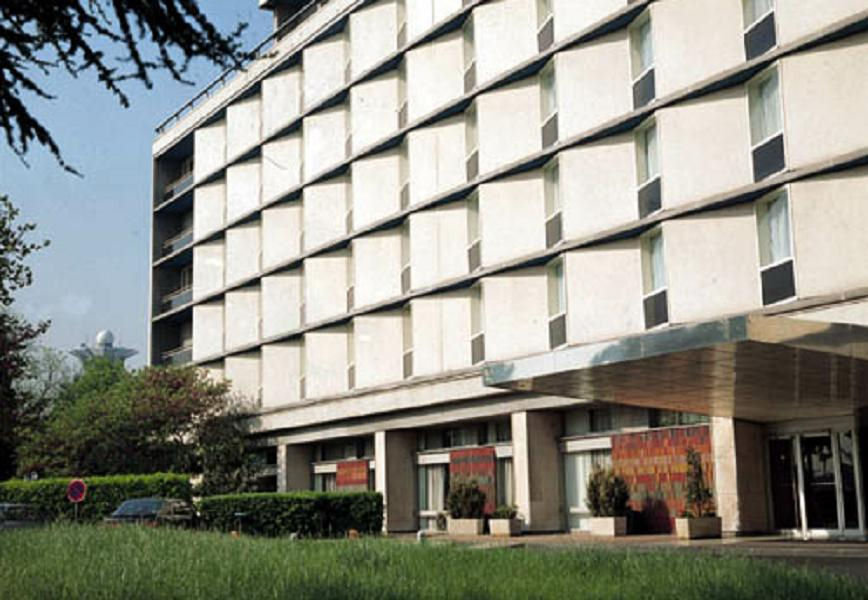|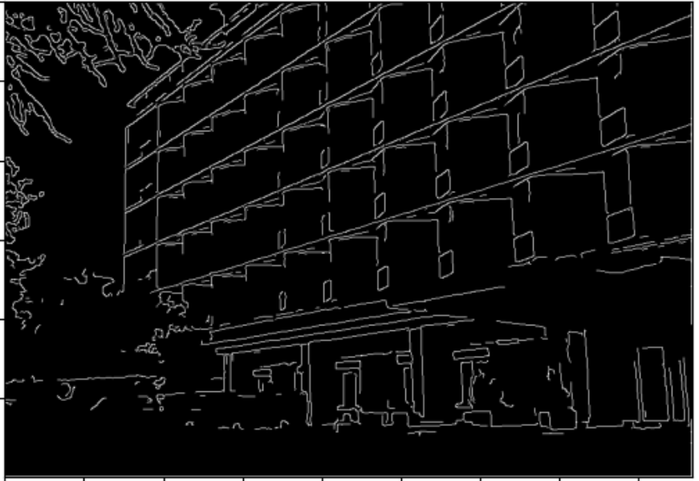|

## Line Detection 
Detection of lines in images using hough space 

| Image | Hough Space |
|----| ----|
|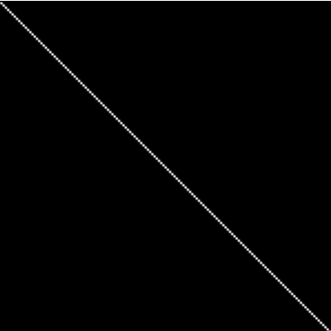 |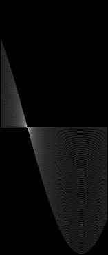  |

Results on real Image

|  |  |
|----| ----|
| |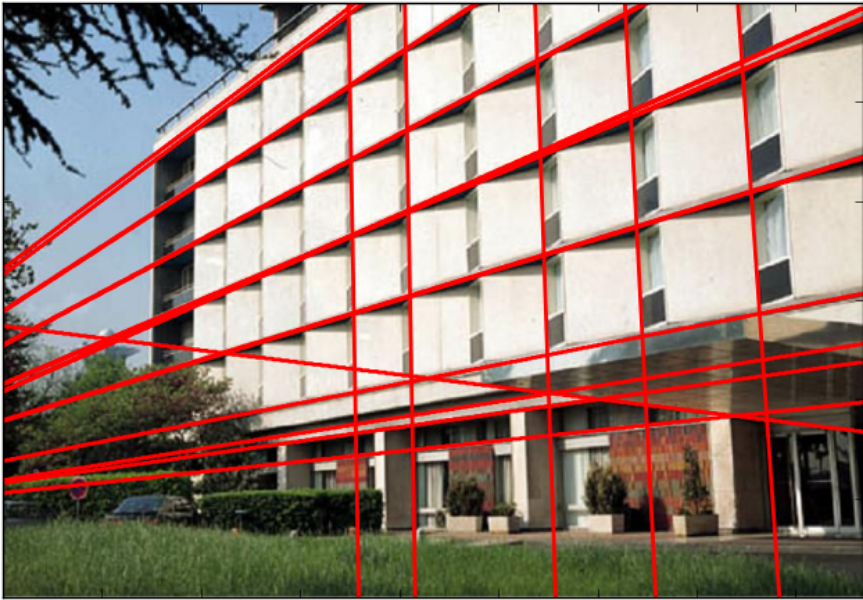  |

## Corner Detection 

### Harris Corner Detector
|  |  |
|----| ----|
|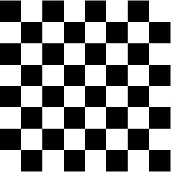 |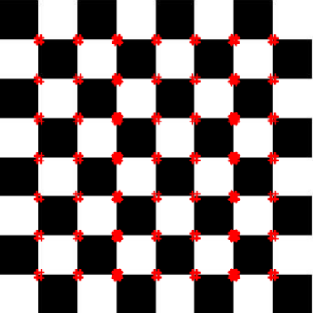  |

### Fast Corner Detector
|  |  |
|----| ----|
| |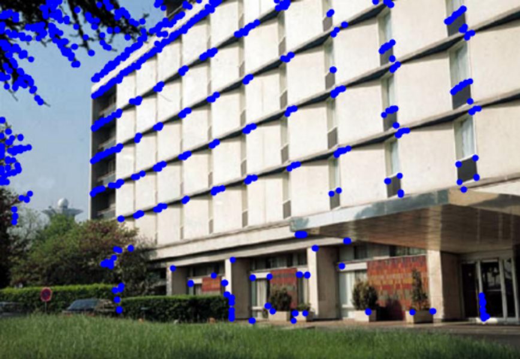  |

## Image Segmentation 

### Threshod based Segmentation

Otsu thresholding using both within and between class variances methods

|  |  |
|----| ----|
|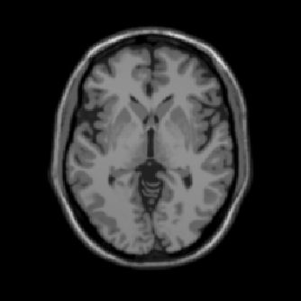 |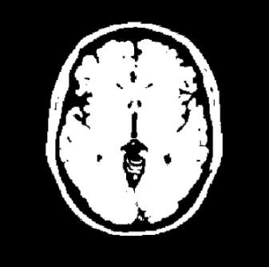  |

### Region Based Segmentation

Region growing segmentation algorithm 

|  |  |
|----| ----|
| |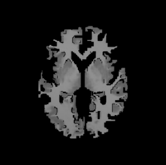  |

### Color Based Segmentation

#### Kmeans Segmentation (Clustering)

|  |  |
|----| ----|
| |  |

#### Mean Shift Segmentation (Clustering)

|  |  |
|----| ----|
| |  |